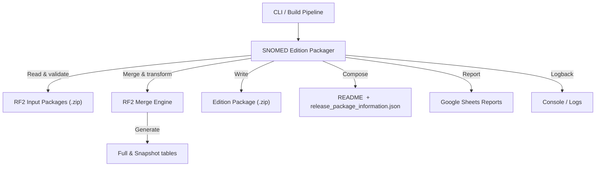
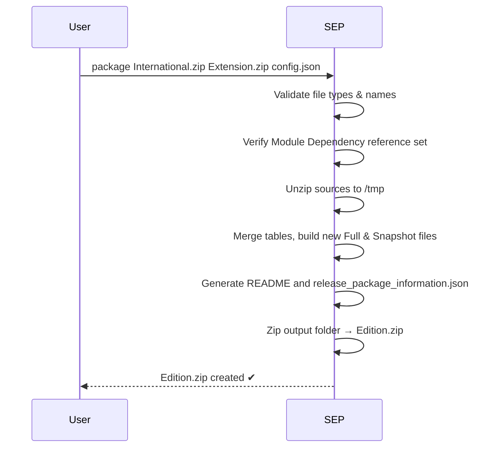

# SNOMED Edition Packager (SEP)

The **SNOMED Edition Packager (SEP)** is a Spring Boot & Spring Shell–based command-line application that automates the creation of a consolidated **SNOMED CT Edition** by merging the International Release with one or more Extension packages.  
It validates module dependencies, generates fresh **Full** and **Snapshot** RF2 files, produces a contextual README & `release_package_information.json`, and finally delivers a single zip archive ready for publication.

> In short: drop your source `.zip` files in a folder, run `package`, and get a brand-new edition package out the other side.

> ⚠️ **IMPORTANT:**
> The quality and integrity of RF2 packages generated using this tool cannot be guaranteed by SNOMED International.
> It is, therefore, both required and presumed that users of this tool will independently verify and validate any
> generated RF2 packages before use.

---

## 1  High-Level Architecture



<br/>

### Typical Packaging Flow



Key points:
* **Stateless** – all processing happens in-memory; no external database required.
* Uses **Streaming I/O** to keep large RF2 files manageable.
* Packaged as a self-contained fat JAR (created by the Spring Boot Maven plugin) – easy to drop into any CI pipeline.

---

## 2  Feature Highlights

* **Spring Shell CLI** – `PackageCommand` exposes a single, ergonomic `package` command with comprehensive options.
* **Reporting & Analysis** – `ReportCommand` generates detailed Google Sheets reports analyzing RF2 package contents.
* **Modular Import & Export Pipeline** – `ImportService` and `ExportService` orchestrate pluggable writers/readers for each RF2 component type.
* **In-Memory DataStore** – caches Concepts, Descriptions, Relationships, Axioms, RefSet Members, Identifiers and more for ultra-fast processing and optional natural ordering.
* **Wildcard & Comma-Separated Arguments** – flexible CLI parsing via the new `Arguments` domain object (`*` indicates "use sensible default").
* **Automatic Empty File Generation** – `WriteEmptyFiles` creates placeholder RF2 tables for reference sets that otherwise have no content, ensuring downstream validators stay happy.
* **Comprehensive RF2 Coverage** – writers exist for Concepts, Descriptions, Text Definitions, (Stated / Concrete) Relationships, Axioms, Reference-set Members and Identifiers.
* **Release-Package Metadata** – builds `release_package_information.json` with effectiveTime, licence statement, language ref-sets, etc.
* **Deterministic Full & Snapshot Derivation** – optional natural ordering across all component files when `--sort true` is supplied.
* **Beta Release Support** – recognises `BETA_` prefixes and preserves them in the final artefact.
* **Google Sheets Integration** – produces detailed reports with multiple tabs and CSV data export for package analysis.
* **Zip4j Integration** – faster and more reliable than the standard JDK `java.util.zip`.
* **Structured Logging** – SLF4J + Logback configuration in `src/main/resources/logback.xml`.

---

## 3  Project Layout

```text
src/
  main/
    java/org/snomed/snomededitionpackager
      command/         ← Spring Shell adapter (PackageCommand, ReportCommand, Handlers)
      configuration/   ← Spring `@Configuration` classes & beans
      domain/
        arguments/     ← CLI argument parsing helpers
        datastore/     ← In-memory DataStore
        importing/     ← Unzip & load packages into memory
        exporting/     ← Writers & zip assembly logic
        reporting/     ← Google Sheets report generation
        rf2/           ← RF2 component domain models
      # (legacy) rf2/  ← Backwards-compatible merge utilities (to be refactored away)
    resources/         ← `application.properties`, Logback, etc.
  test/                ← JUnit & Spring Shell tests
  docs/                ← Usage guide & additional docs
```

Important classes:
* `Main.java`              – Spring Boot entry-point.
* `PackageCommand.java`    – CLI facade for packaging operations.
* `ReportCommand.java`     – CLI facade for report generation.
* `PackageHandler.java`    – Orchestrates import → export pipeline.
* `ReportHandler.java`     – Orchestrates RF2 package analysis and reporting.
* `ImportService.java`     – Loads source packages into the `DataStore`.
* `ExportService.java`     – Writes new Full & Snapshot tables and assembles the zip.
* `ReportingService.java`  – Manages Google Sheets report creation and data writing.
* `DataStore.java`         – In-memory cache and sorting logic.
* `FileNameService.java`   – Centralised RF2 filename conventions.

---

## 4  Getting Started Locally

### 4.1  Prerequisites

1. **JDK 17** (matching the parent BOM).
2. **Maven 3.8+** (wrapper provided → `./mvnw`).
3. ≥ **14 GB RAM** minimum (the merge process is memory intensive).
4. **Google Sheets API access** (optional, for report generation features).

### 4.2  Clone & Build

```bash
git clone https://github.com/IHTSDO/snomed-edition-packager.git
cd snomed-edition-packager
./mvnw clean package
```

`package` produces `target/snomed-edition-packager-executable.jar`.

### 4.3  Configuration (Optional)

#### Application Properties
Modify `src/main/resources/application.properties` to configure:
- **Logging levels** – `logging.level.org.snomed.snomededitionpackager=TRACE`
- **Environment settings** – `app.environment=local`
- **Spring Shell history** – `spring.shell.history.enabled=false`

### 4.4  Run

```bash
java -Xms14g -Xmx14g \
     -jar target/snomed-edition-packager-executable.jar
```

## 5  Performance & Troubleshooting

* Ensure you allocate sufficient heap (`-Xmx`).  Out-of-memory errors are the most common issue when handling very large RF2 tables.
* Temporary folders `INPUT/` and `OUTPUT/` are created in the working directory; if the process terminates abnormally you may delete them manually.
* Increase log verbosity with `--logging.level.org.snomed=DEBUG` if you need deeper insight.
* For Google Sheets reporting, ensure proper API credentials are configured in your environment.
* Report generation requires internet connectivity to access Google Sheets API.

---

© International Health Terminology Standards Development Organisation 2024.  All rights reserved.