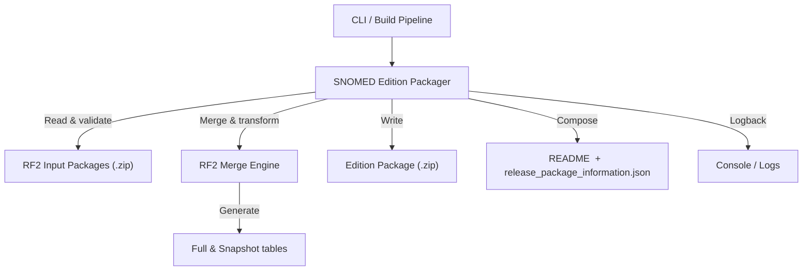
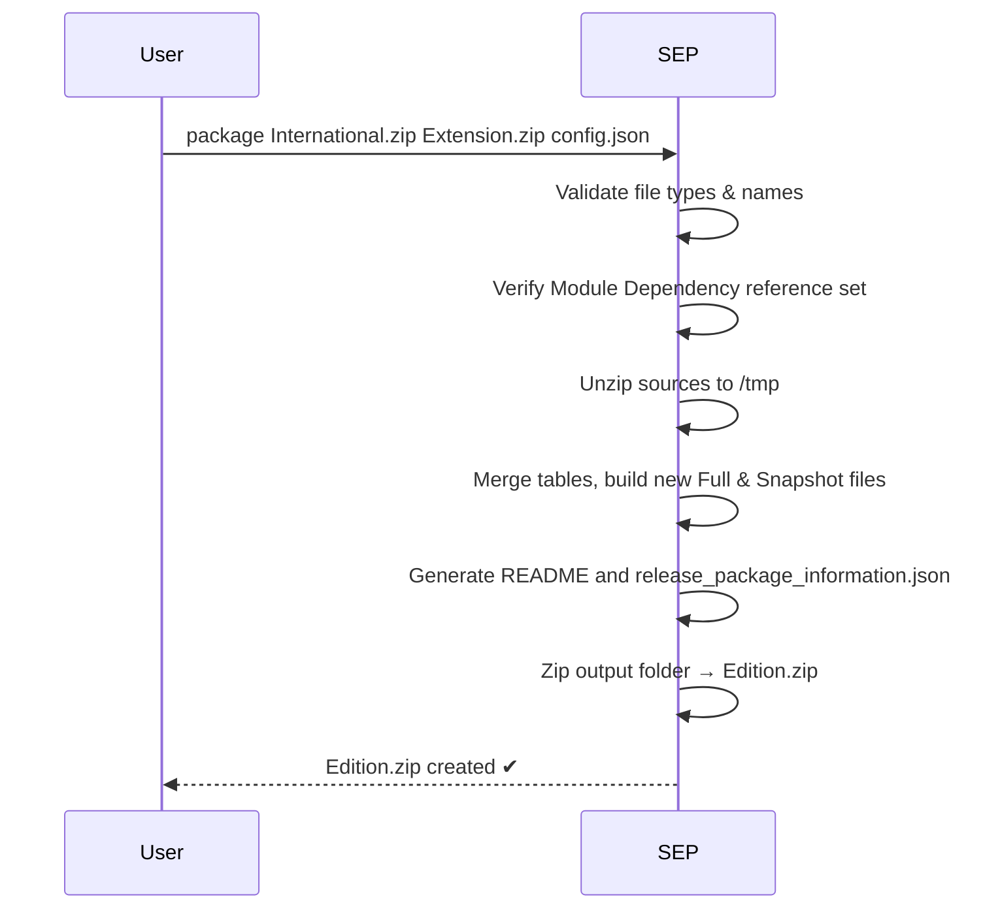

# SNOMED Edition Packager (SEP)

The **SNOMED Edition Packager (SEP)** is a Spring Boot & Spring Shell–based command-line application that automates the creation of a consolidated **SNOMED CT Edition** by merging the International Release with one or more Extension packages.  
It validates module dependencies, generates fresh **Full** and **Snapshot** RF2 files, produces a contextual README & `release_package_information.json`, and finally delivers a single zip archive ready for publication.

> In short: drop your source `.zip` files in a folder, run `package`, and get a brand-new edition package out the other side.

---

## 1  High-Level Architecture



<br/>

### Typical Packaging Flow



Key points:
* **Stateless** – all processing happens in-memory; no external database required.
* Uses **Streaming I/O** to keep large RF2 files manageable.
* Packaged as a self-contained fat JAR (created by the Spring Boot Maven plugin) – easy to drop into any CI pipeline.

---

## 2  Feature Highlights

* **Spring Shell CLI** – `PackageCommand` exposes a single, ergonomic `package` command.
* **Module Dependency Validation** – guarantees your extension is compatible with the chosen international baseline (see `Rf2FileExportRunner.MDRSFactory`).
* **Automatic README Generation** – configurable via `config.json` and powered by `ReadmeGenerator`.
* **Release-Package Metadata** – creates `release_package_information.json` with effectiveTime, language ref-sets, licence statement, etc.
* **Full & Snapshot Derivation** – deterministic ordering of records thanks to `RF2TableExportDAO` utilities.
* **Beta Release Support** – recognises `BETA_` prefixes and preserves them in the final artefact.
* **Zip4j Integration** – faster and more reliable than the standard JDK `java.util.zip`.
* **Structured Logging** – SLF4J + Logback configuration in `src/main/resources/logback.xml`.

---

## 3  Project Layout

```
src/
  main/
    java/org/snomed/snomededitionpackager
      key/          ← RF2 component key helpers
      rf2/          ← Merge engine & RF2 utilities
      util/         ← README & package-info generators
    resources/      ← `config.json`, Logback, etc.
  test/              ← JUnit & Spring Shell tests
  docs/              ← Usage guide & additional docs
```

Important classes:
* `Main.java`   – Spring Boot entry-point.
* `PackageCommand.java`   – CLI facade.
* `Rf2FileExportRunner.java`   – heart of the merge process.

---

## 4  Getting Started Locally

### 4.1  Prerequisites

1. **JDK 17** (matching the parent BOM).
2. **Maven 3.8+** (wrapper provided → `./mvnw`).
3. ≥ **8 GB RAM** (the merge process is memory intensive – 14 GB recommended for large editions).

### 4.2  Clone & Build

```bash
git clone https://github.com/IHTSDO/snomed-edition-packager.git
cd snomed-edition-packager
./mvnw clean package
```

`package` produces `target/snomed-edition-packager-executable.jar`.

### 4.3  Configuration (Optional)

If you need a customised README or release metadata, create/modify a `config.json` file – a reference example lives under `src/main/resources/config.json`.

### 4.4  Run

```bash
java -Xms4g -Xmx14g \
     -jar target/snomed-edition-packager-executable.jar
```

Once the Spring Shell prompt appears, execute one of the following:

```bash
package *                                      # Merge all .zip + config.json in working dir
package SnomedCT_InternationalRF2_*.zip MyExt.zip config.json
```

The resulting **Edition.zip** can be found in the current directory when the process completes.

---

## 5  Performance & Troubleshooting

* Ensure you allocate sufficient heap (`-Xmx`).  Out-of-memory errors are the most common issue when handling very large RF2 tables.
* Temporary folders `INPUT/` and `OUTPUT/` are created in the working directory and deleted automatically; if the process terminates abnormally you may delete them manually.
* Increase log verbosity with `--logging.level.org.snomed=DEBUG` if you need deeper insight.

---

## 6  Contributing & License

* Pull requests are welcome – please follow conventional commit messages and add/maintain unit tests.
* Code style: Google Java Format (run `mvn fmt:format` before committing).
* This project is licensed under the terms of the **Apache License 2.0** – see [`LICENSE.md`](LICENSE.md).

---

© International Health Terminology Standards Development Organisation 2024.  All rights reserved.